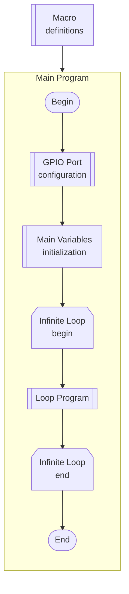

# MCU_Course

# Register Bit Manipulation in Microcontrollers

When working with hardware registers in microcontrollers, we often need to **set, clear, or modify specific bits** without affecting the others.  
This is typically done using **bitwise operators** in C.

## Setting a Single Bit

To set a specific bit to `1`, use the **bit-shift (`<<`)** operator to move a `1` into the correct position, and then apply the **bitwise OR (`|`)** operator.  
This ensures that only the target bit is modified, while all other bits remain unchanged.

|        |        |        |        |        |        |        |        |        |        |        |        |        |        |        |        |
| ------ | ------ | ------ | ------ | ------ | ------ | ------ | ------ | ------ | ------ | ------ | ------ | ------ | ------ | ------ | ------ |
| Bit 31 | Bit 30 | Bit 29 | Bit 28 | Bit 27 | Bit 26 | Bit 25 | Bit 24 | Bit 23 | Bit 22 | Bit 21 | Bit 20 | Bit 19 | Bit 18 | Bit 17 | Bit 16 |
| 0      | 0      | 0      | 0      | 0      | 0      | 0      | 0      | 0      | 0      | 0      | 0      | 0      | 0      | 0      | 0      |
| Bit 15 | Bit 14 | Bit 13 | Bit 12 | Bit 11 | Bit 10 | Bit 9  | Bit 8  | Bit 7  | Bit 6  | Bit 5  | Bit 4  | Bit 3  | Bit 2  | Bit 1  | Bit 0  |
| 0      | 0      | 0      | 0      | 0      | 0      | 0      | 0      | 0      | 0      | 0      | 0      | 0      | 0      | 0      | 0      |

```
*((uint32_t *) REGISTER_ADDRESS) = *((uint32_t *) REGISTER_ADDRESS) | (1 << 9);          // Set bit 9
```
or simply
```
*((uint32_t *) REGISTER_ADDRESS) |= 1 << 9;
```

|        |        |        |        |        |        |        |        |        |        |        |        |        |        |        |        |
| ------ | ------ | ------ | ------ | ------ | ------ | ------ | ------ | ------ | ------ | ------ | ------ | ------ | ------ | ------ | ------ |
| Bit 31 | Bit 30 | Bit 29 | Bit 28 | Bit 27 | Bit 26 | Bit 25 | Bit 24 | Bit 23 | Bit 22 | Bit 21 | Bit 20 | Bit 19 | Bit 18 | Bit 17 | Bit 16 |
| 0      | 0      | 0      | 0      | 0      | 0      | 0      | 0      | 0      | 0      | 0      | 0      | 0      | 0      | 0      | 0      |
| Bit 15 | Bit 14 | Bit 13 | Bit 12 | Bit 11 | Bit 10 | Bit 9  | Bit 8  | Bit 7  | Bit 6  | Bit 5  | Bit 4  | Bit 3  | Bit 2  | Bit 1  | Bit 0  |
| 0      | 0      | 0      | 0      | 0      | 0      | ==1==  | 0      | 0      | 0      | 0      | 0      | 0      | 0      | 0      | 0      |

___
## Setting Multiple Bits (Bit Field)

If a field (several bits in a row) must be updated, we shift the desired value into the correct position

|        |        |        |        |        |        |        |        |        |        |        |        |        |        |        |        |
| ------ | ------ | ------ | ------ | ------ | ------ | ------ | ------ | ------ | ------ | ------ | ------ | ------ | ------ | ------ | ------ |
| Bit 31 | Bit 30 | Bit 29 | Bit 28 | Bit 27 | Bit 26 | Bit 25 | Bit 24 | Bit 23 | Bit 22 | Bit 21 | Bit 20 | Bit 19 | Bit 18 | Bit 17 | Bit 16 |
| 0      | 0      | 0      | 0      | 0      | 0      | 0      | 0      | 0      | 0      | 0      | 0      | 0      | 0      | 0      | 0      |
| Bit 15 | Bit 14 | Bit 13 | Bit 12 | Bit 11 | Bit 10 | Bit 9  | Bit 8  | Bit 7  | Bit 6  | Bit 5  | Bit 4  | Bit 3  | Bit 2  | Bit 1  | Bit 0  |
| 0      | 0      | 0      | 0      | 0      | 0      | 1      | 0      | 0      | 0      | 0      | 0      | 0      | 0      | 0      | 0      |

```
*((uint32_t *) REGISTER_ADDRESS) |= 5 << 6;          // Write 0b101 = 5 into bits [8:6]
```

|        |        |        |        |        |        |        |        |        |        |        |        |        |        |        |        |
| ------ | ------ | ------ | ------ | ------ | ------ | ------ | ------ | ------ | ------ | ------ | ------ | ------ | ------ | ------ | ------ |
| Bit 31 | Bit 30 | Bit 29 | Bit 28 | Bit 27 | Bit 26 | Bit 25 | Bit 24 | Bit 23 | Bit 22 | Bit 21 | Bit 20 | Bit 19 | Bit 18 | Bit 17 | Bit 16 |
| 0      | 0      | 0      | 0      | 0      | 0      | 0      | 0      | 0      | 0      | 0      | 0      | 0      | 0      | 0      | 0      |
| Bit 15 | Bit 14 | Bit 13 | Bit 12 | Bit 11 | Bit 10 | Bit 9  | Bit 8  | Bit 7  | Bit 6  | Bit 5  | Bit 4  | Bit 3  | Bit 2  | Bit 1  | Bit 0  |
| 0      | 0      | 0      | 0      | 0      | 0      | 1      | ==1==  | 0      | ==1==  | 0      | 0      | 0      | 0      | 0      | 0      |

___
## Clearing a Single Bit

To clear (reset) a bit to `0`, use the **bitwise AND (`&`)** operator with the **inverted mask** (`~`).  
This forces the target bit to `0` without touching the others.

|        |        |        |        |        |        |        |        |        |        |        |        |        |        |        |        |
| ------ | ------ | ------ | ------ | ------ | ------ | ------ | ------ | ------ | ------ | ------ | ------ | ------ | ------ | ------ | ------ |
| Bit 31 | Bit 30 | Bit 29 | Bit 28 | Bit 27 | Bit 26 | Bit 25 | Bit 24 | Bit 23 | Bit 22 | Bit 21 | Bit 20 | Bit 19 | Bit 18 | Bit 17 | Bit 16 |
| 0      | 0      | 0      | 0      | 0      | 0      | 0      | 0      | 0      | 0      | 0      | 0      | 0      | 0      | 0      | 0      |
| Bit 15 | Bit 14 | Bit 13 | Bit 12 | Bit 11 | Bit 10 | Bit 9  | Bit 8  | Bit 7  | Bit 6  | Bit 5  | Bit 4  | Bit 3  | Bit 2  | Bit 1  | Bit 0  |
| 0      | 0      | 0      | 0      | 0      | 0      | 1      | 1      | 0      | 1      | 0      | 0      | 0      | 0      | 0      | 0      |

```
*((uint32_t *) REGISTER_ADDRESS) &= ~(1 << 6)          // Clear bit 6
```

|        |        |        |        |        |        |        |        |        |        |        |        |        |        |        |        |
| ------ | ------ | ------ | ------ | ------ | ------ | ------ | ------ | ------ | ------ | ------ | ------ | ------ | ------ | ------ | ------ |
| Bit 31 | Bit 30 | Bit 29 | Bit 28 | Bit 27 | Bit 26 | Bit 25 | Bit 24 | Bit 23 | Bit 22 | Bit 21 | Bit 20 | Bit 19 | Bit 18 | Bit 17 | Bit 16 |
| 0      | 0      | 0      | 0      | 0      | 0      | 0      | 0      | 0      | 0      | 0      | 0      | 0      | 0      | 0      | 0      |
| Bit 15 | Bit 14 | Bit 13 | Bit 12 | Bit 11 | Bit 10 | Bit 9  | Bit 8  | Bit 7  | Bit 6  | Bit 5  | Bit 4  | Bit 3  | Bit 2  | Bit 1  | Bit 0  |
| 0      | 0      | 0      | 0      | 0      | 0      | 1      | 1      | 0      | ==0==  | 0      | 0      | 0      | 0      | 0      | 0      |

___
## Clearing a Bit Field

The same logic works for fields: create a mask covering all bits in the field, invert it, and apply `&=`.

|        |        |        |        |        |        |        |        |        |        |        |        |        |        |        |        |
| ------ | ------ | ------ | ------ | ------ | ------ | ------ | ------ | ------ | ------ | ------ | ------ | ------ | ------ | ------ | ------ |
| Bit 31 | Bit 30 | Bit 29 | Bit 28 | Bit 27 | Bit 26 | Bit 25 | Bit 24 | Bit 23 | Bit 22 | Bit 21 | Bit 20 | Bit 19 | Bit 18 | Bit 17 | Bit 16 |
| 0      | 0      | 0      | 0      | 0      | 0      | 0      | 0      | 0      | 0      | 0      | 0      | 0      | 0      | 0      | 0      |
| Bit 15 | Bit 14 | Bit 13 | Bit 12 | Bit 11 | Bit 10 | Bit 9  | Bit 8  | Bit 7  | Bit 6  | Bit 5  | Bit 4  | Bit 3  | Bit 2  | Bit 1  | Bit 0  |
| 0      | 0      | 0      | 0      | 0      | 0      | 1      | 1      | 0      | 0      | 0      | 0      | 0      | 0      | 0      | 0      |

```
*((uint32_t *) REGISTER_ADDRESS) &= ~(2 << 8)          // 3 = 0b11
```

|        |        |        |        |        |        |        |        |        |        |        |        |        |        |        |        |
| ------ | ------ | ------ | ------ | ------ | ------ | ------ | ------ | ------ | ------ | ------ | ------ | ------ | ------ | ------ | ------ |
| Bit 31 | Bit 30 | Bit 29 | Bit 28 | Bit 27 | Bit 26 | Bit 25 | Bit 24 | Bit 23 | Bit 22 | Bit 21 | Bit 20 | Bit 19 | Bit 18 | Bit 17 | Bit 16 |
| 0      | 0      | 0      | 0      | 0      | 0      | 0      | 0      | 0      | 0      | 0      | 0      | 0      | 0      | 0      | 0      |
| Bit 15 | Bit 14 | Bit 13 | Bit 12 | Bit 11 | Bit 10 | Bit 9  | Bit 8  | Bit 7  | Bit 6  | Bit 5  | Bit 4  | Bit 3  | Bit 2  | Bit 1  | Bit 0  |
| 0      | 0      | 0      | 0      | 0      | 0      | ==0==  | ==0==  | 0      | 0      | 0      | 0      | 0      | 0      | 0      | 0      |

___
## Toggling a Bit

To **invert** (toggle) a bit from `0→1` or `1→0`, use the **bitwise XOR (`^`)** operator.

|        |        |        |        |        |        |        |        |        |        |        |        |        |        |        |        |
| ------ | ------ | ------ | ------ | ------ | ------ | ------ | ------ | ------ | ------ | ------ | ------ | ------ | ------ | ------ | ------ |
| Bit 31 | Bit 30 | Bit 29 | Bit 28 | Bit 27 | Bit 26 | Bit 25 | Bit 24 | Bit 23 | Bit 22 | Bit 21 | Bit 20 | Bit 19 | Bit 18 | Bit 17 | Bit 16 |
| 0      | 0      | 0      | 0      | 0      | 0      | 0      | 0      | 0      | 0      | 0      | 0      | 0      | 0      | 0      | 0      |
| Bit 15 | Bit 14 | Bit 13 | Bit 12 | Bit 11 | Bit 10 | Bit 9  | Bit 8  | Bit 7  | Bit 6  | Bit 5  | Bit 4  | Bit 3  | Bit 2  | Bit 1  | Bit 0  |
| 0      | 0      | 0      | 0      | 0      | 0      | 0      | 0      | 0      | 0      | 0      | 0      | 0      | 0      | 0      | 0      |

```
*((uint32_t *) REGISTER_ADDRESS) ^= (1 << 3);          // Toggle bit 3
```

|        |        |        |        |        |        |        |        |        |        |        |        |        |        |        |        |
| ------ | ------ | ------ | ------ | ------ | ------ | ------ | ------ | ------ | ------ | ------ | ------ | ------ | ------ | ------ | ------ |
| Bit 31 | Bit 30 | Bit 29 | Bit 28 | Bit 27 | Bit 26 | Bit 25 | Bit 24 | Bit 23 | Bit 22 | Bit 21 | Bit 20 | Bit 19 | Bit 18 | Bit 17 | Bit 16 |
| 0      | 0      | 0      | 0      | 0      | 0      | 0      | 0      | 0      | 0      | 0      | 0      | 0      | 0      | 0      | 0      |
| Bit 15 | Bit 14 | Bit 13 | Bit 12 | Bit 11 | Bit 10 | Bit 9  | Bit 8  | Bit 7  | Bit 6  | Bit 5  | Bit 4  | Bit 3  | Bit 2  | Bit 1  | Bit 0  |
| 0      | 0      | 0      | 0      | 0      | 0      | 0      | 0      | 0      | 0      | 0      | 0      | ==1==  | 0      | 0      | 0      |

```
*((uint32_t *) REGISTER_ADDRESS) ^= (1 << 3);          // Toggle bit 3 again
```

|        |        |        |        |        |        |        |        |        |        |        |        |        |        |        |        |
| ------ | ------ | ------ | ------ | ------ | ------ | ------ | ------ | ------ | ------ | ------ | ------ | ------ | ------ | ------ | ------ |
| Bit 31 | Bit 30 | Bit 29 | Bit 28 | Bit 27 | Bit 26 | Bit 25 | Bit 24 | Bit 23 | Bit 22 | Bit 21 | Bit 20 | Bit 19 | Bit 18 | Bit 17 | Bit 16 |
| 0      | 0      | 0      | 0      | 0      | 0      | 0      | 0      | 0      | 0      | 0      | 0      | 0      | 0      | 0      | 0      |
| Bit 15 | Bit 14 | Bit 13 | Bit 12 | Bit 11 | Bit 10 | Bit 9  | Bit 8  | Bit 7  | Bit 6  | Bit 5  | Bit 4  | Bit 3  | Bit 2  | Bit 1  | Bit 0  |
| 0      | 0      | 0      | 0      | 0      | 0      | 0      | 0      | 0      | 0      | 0      | 0      | ==0==  | 0      | 0      | 0      |

___

## Checking (Reading) a Bit

To test if a bit is set:

```
if (*((uint32_t *) REGISTER_ADDRESS) & (1 << 12))
{
    // Bit 12 is set
}
```


